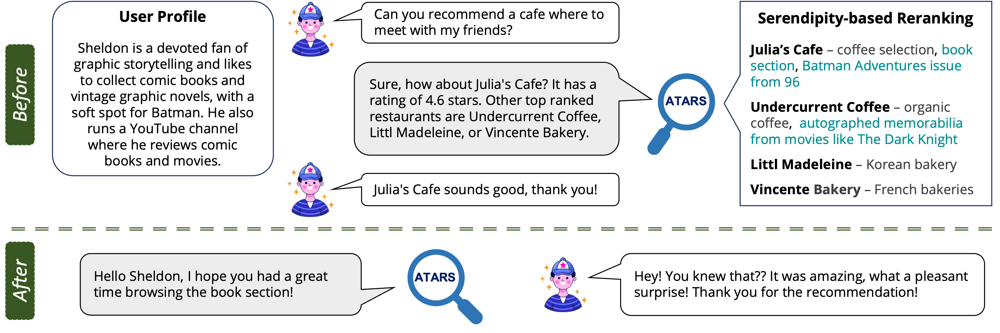

# Engineering Serendipity through Recommendations of Items with Atypical Aspects
This repository contains the source code and datasets for Atypical Aspect-Based Recommender System (ATARS) as described in the paper. ["Engineering Serendipity through Recommendations of Items with Atypical Aspects"](https://arxiv.org/pdf/2505.23580) currently under review at ACM Transactions on Recommender Systems.

  

