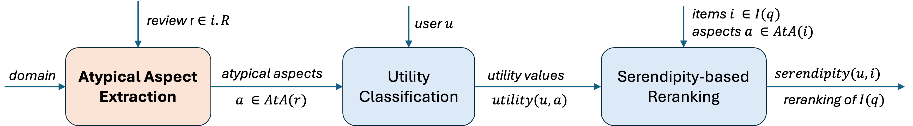

# Extraction of Atypical Aspects from Customer Reviews

  

Extraction is done in 2 main steps:
- Step 1: Process the review into a list of aspect sentences that capture all the aspects of the restaurant, typical or atypical. Other types of information, such as opinions or incidental information that does not pertain to the restaurant, are to be ignored. 
- Step 2: Extract atypical aspects from the list of aspect sentences, as shown below,
    - Step 2.1: Classify each aspect sentence as positive if it mentions an atypical aspect, otherwise classify it as negative.
    - Step 2.2: Extract all atypical aspects from each of the sentences classified as positive.

Code for the LLM-based approach (GPT) for Step 1 can be found at `./atypical_aspect_extraction/review_processing_to_aspect_sentences.ipynb`.
 
Code for the LLM-based approach (GPT) for Step 2 can be found at `./atypical_aspect_extraction/extraction_atypical_aspect_pipeline_ZS_FS_RAG.ipynb`.
