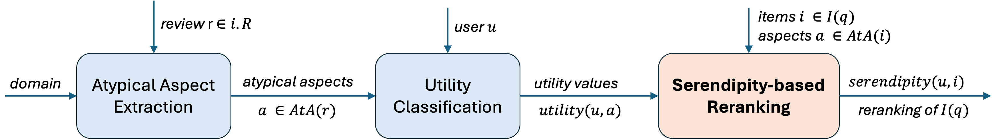
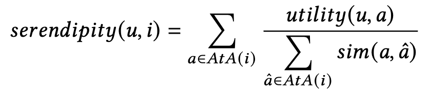

# Serendipity-Based Re-ranking of Items

  

User-dependant Serendipity of an item (restaurant, hotel or hair salon) is defined as the sum of the utility values of all the atypical aspects found across all the reviews of that item, where each utility value is divided by the total similarity of that aspect with all atypical aspects, including itself:

  

Assuming a normalized aspect to aspect similarity measure $sim(a, \hat{a}) \in [0,1]$, with a value of 1 if and only if $\hat{a} = a$, this means that:

    $serendipity(u, i) = \sum_{a \in AtA(i)} \frac{utility(u, a)}{\displaystyle\sum_{\hat{a} \in AtA(i)} sim(a, \hat{a})}$
