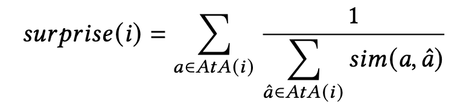

# Serendipity-Based Re-ranking of Items

  

User-dependant Serendipity of an item (restaurant, hotel or hair salon) is defined as the sum of the utility values of all the atypical aspects found across all the reviews of that item, where each utility value is divided by the total similarity of that aspect with all atypical aspects, including itself.

  

Assuming a normalized aspect to aspect similarity measure $sim(a, \hat{a}) \in [0,1]$, with a value of 1 if and only if $\hat{a} = a$, this means that:
- When all aspects are identical, each utility value in the sum above is divided by the total number of atypical aspects for that item, effectively producing a mean utility.
- When each aspect has zero similarity with other aspects, each utility value in the sum above is divided by 1, effectively producing a sum of utilities.

Also, a user-independant measure of surprise is for an item (restaurant, hotel or hair salon) is defined by setting the utility value to 1 for all atypical aspects of that item.

  

