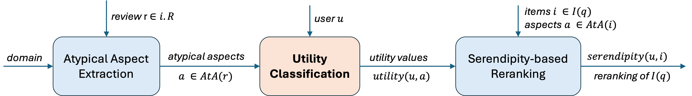

# Mapping Atypical Aspects to User-dependent Utility

  

A diverse set of synthetic user profiles are generated using LLM that can be used in combination with the dataset of atypical aspect annotated reviews to estimate potential atypical aspect utilities.

Code for the LLM-based approach (GPT) can be found at `./user_profile_generation.ipynb`.

Utility classification is done by providing the LLM as input, both a user profile and a positive aspect sentence, where exactly one atypical aspect is tagged. The LLM is instructed to estimate the utility value of that atypical aspect relative to the user profile. To ensure a fair evaluation of the LLM-based approach, the same annotation guidelines that were provided to the MTurk workers were also incorporated in the prompt instructions.

Code for the LLM-based approach (GPT) can be found at `./matching_atypical_aspects_to_user_profiles.ipnyb`.
